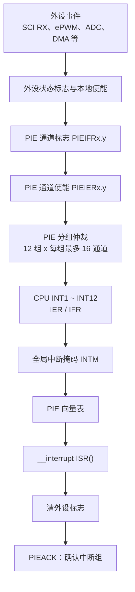

# F280049 中断架构与 STM32 对比

## 核心结论

F280049 的普通外设中断路径不是 STM32 常见的“外设 → NVIC → Cortex-M”，而是：

```text
外设 → ePIE（外设中断扩展）→ C28x CPU
```

PIE 负责将大量外设中断信号分组、仲裁并扩展为独立向量。ISR 除了清除外设的中断原因外，还要确认所属 PIE 组（ACK）。

## 硬件架构



C28x CPU 有 14 条可屏蔽外设中断输入：

```text
INT1 ~ INT12：来自 PIE Group 1 ~ 12
INT13：CPU Timer 1，直接连接 CPU
INT14：CPU Timer 2，直接连接 CPU
```

NMI、复位、非法指令等属于特殊异常路径，不走普通 PIE 中断流程。

## 四层使能与标志

一个外设 ISR 能被执行，需要下面的链路同时成立：

| 层级 | 标志表示什么 | 使能表示什么 |
| --- | --- | --- |
| 外设 | 事件已经发生，例如 SCI RX FIFO 达阈值 | 该外设是否允许发出中断请求 |
| PIE 通道 | 某个 Group/Channel 正在挂起 | `PIEIERx.y` 是否允许该通道传播 |
| CPU 中断组 | 某个 CPU INTx 正在挂起 | `IER.x` 是否允许该组进入 CPU |
| 全局 | CPU 是否接受普通中断 | `INTM=0`，`EINT` 开启；`DINT` 关闭 |

向量表不是使能开关，它只是指定“发生该中断后要跳转到哪个 ISR”。

## PIE 优先级

优先级主要是固定硬件规则：

```text
更小的 CPU Group 编号优先级更高。
同一 PIE Group 内，更小的 Channel 编号优先级更高。
```

例如 SCIB RX 为 Group 9 / Channel 3。若 Group 9 的 Channel 1 与 Channel 3 同时挂起，PIE 先选择 Channel 1。

默认情况下，普通中断不嵌套。进入 ISR 后，CPU 会屏蔽普通中断；需要嵌套时，必须谨慎由软件调整 `IER`、`PIEIERx` 与 `INTM`。

## 标准软件框架

```c
// 1. 初始化并清空 CPU/PIE 中断状态
Interrupt_initModule();
Interrupt_initVectorTable();

// 2. 配置外设，但先保持其本地中断源关闭或清标志
// 3. 注册 ISR 到正确 PIE 向量
Interrupt_register(INT_SCIB_RX, &scirxISR);

// 4. 使能 PIE 通道与对应 CPU 中断组
Interrupt_enable(INT_SCIB_RX);

// 5. 清除可能的遗留外设标志，再使能外设本地中断源
SCI_clearInterruptStatus(SCIB_BASE, SCI_INT_RXFF | SCI_INT_RXERR);
SCI_enableInterrupt(SCIB_BASE, SCI_INT_RXFF | SCI_INT_RXERR);

// 6. 确保全局中断已开启
EINT;
```

通用 ISR 框架：

```c
__interrupt void myISR(void)
{
    // 1. 读取并保存外设状态
    // 2. 处理数据或错误；ISR 保持短小
    // 3. 清除外设中断原因
    // 4. ACK 此 ISR 所在的 PIE Group
    Interrupt_clearACKGroup(INTERRUPT_ACK_GROUPx);
}
```

建议 ISR 只做采样、搬运数据、置标志或写入软件队列；字符串解析、`printf`、等待发送完成等耗时工作交给主循环或低优先级任务。

共享于主循环和 ISR 的变量应使用 `volatile`。多字节共享数据、环形缓冲区读写以及 DMA 共享缓冲区还要考虑临界区与一致性。

## 与 STM32 的对比

| 主题 | STM32 | F280049 |
| --- | --- | --- |
| 中间控制器 | NVIC | PIE |
| 常见路径 | 外设 → NVIC → Cortex-M | 外设 → PIE → C28x CPU |
| 启用步骤 | 外设中断使能 + `HAL_NVIC_EnableIRQ()` | 外设使能 + PIE 通道 + CPU Group + 全局中断 |
| 优先级 | NVIC 可配抢占/子优先级 | Group 与 Channel 固定优先级；嵌套主要由软件控制 |
| 向量表 | 启动文件中的 `xxx_IRQHandler` | PIE 向量表可在运行时用 `Interrupt_register()` 写入 |
| ISR 返回 | Cortex-M 异常返回自动恢复 NVIC Active 状态 | 编译器为 `__interrupt` 处理现场与 `RETI`；软件还需 PIE ACK |
| ISR 收尾 | 清外设 pending flag | 清外设标志 + ACK PIE Group |

STM32 中的 `PRIMASK`、`BASEPRI` 与 C2000 的 `INTM` 都用于全局屏蔽；但它们的优先级和嵌套机制并不一一对应，不能直接照搬。

## 调试清单

中断不进入时，按顺序检查：

```text
1. 外设时钟是否开启？
2. 外设事件是否真的产生？状态标志是否置位？
3. 外设本地中断使能是否开启？
4. ISR 是否注册到正确 Group/Channel？
5. PIE 通道是否使能？
6. CPU 对应中断组是否使能？
7. INTM 是否允许普通中断？
8. 上一次 ISR 是否清除了外设标志并 ACK 了 PIE 组？
```

相关：[[SCI 串口例程学习笔记]]、[[SCI FIFO 与 STM32 UART 对比]]、[[F280049 时钟树]]
