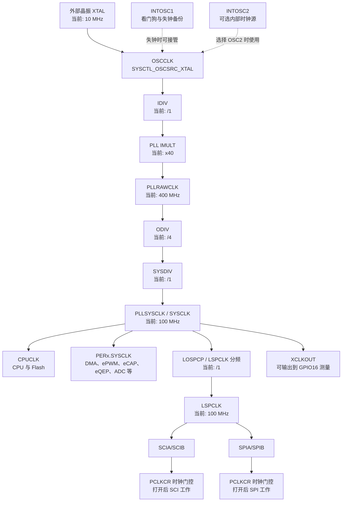

# F280049 时钟树

## 当前工程的完整链路



## 四种改动的影响范围

| 修改位置 | 改变什么 | 受影响模块 |
| --- | --- | --- |
| 时钟源 `SYSCTL_OSCSRC_*` | 参考时钟来源 | 整条时钟树 |
| `IMULT`、`IDIV`、`ODIV`、`SYSDIV` | `SYSCLK` | CPU、PWM、ADC、定时器、SCI、SPI 等下游模块 |
| `LSPCLK_PRESCALE` | `LSPCLK` | 主要是 SCI 与 SPI |
| `SysCtl_enablePeripheral()` | 外设是否得到时钟 | 仅对应模块，频率不变 |

## 分频与门控不是同一件事

```text
分频器：决定时钟频率，例如 100 MHz / 2 = 50 MHz。
门控：决定时钟是否送给某个外设；关闭后该外设停止工作，但其他外设频率不变。
```

例如：

```c
#define LSPCLK_PRESCALE SYSCTL_LSPCLK_PRESCALE_2
```

在当前 100 MHz 系统时钟下会得到：

```text
CPU、ePWM、CPU Timer: 仍为 100 MHz
SCI、SPI 的 LSPCLK: 100 MHz -> 50 MHz
```

SCI 驱动使用 `DEVICE_LSPCLK_FREQ` 计算波特率，因此宏与真实 LSPCLK 一致时，仍可保持串口助手为 115200。

## 建议的验证方法

1. 在程序中读取 `SysCtl_getClock(DEVICE_OSCSRC_FREQ)`，确认运行时 SYSCLK。
2. 使用 `sci_puts_printf` 验证串口不乱码。
3. 必要时把 `XCLKOUT` 输出到 GPIO16，用示波器测量。
4. 再验证 PWM 周期、CPU Timer 和 ADC 采样率。

相关：[[F280049 时钟配置与 Device_init]]、[[SCI 串口例程学习笔记]]
